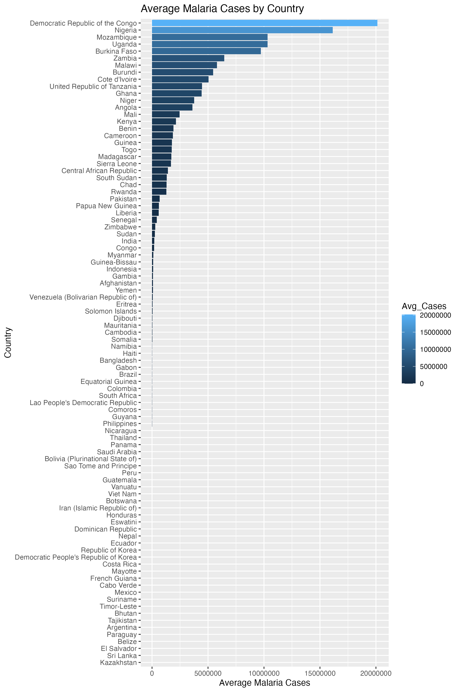

# WHO Malaria Data Analysis in R

Statistical comparison of malaria case burden across countries, using WHO data
and non-parametric hypothesis tests in R.

## Question
Are differences in average malaria cases between countries statistically
significant, or just random variation?

## Data
WHO malaria dataset (`who_malaria_data.csv`): 822 records covering _ countries,
(2015-2024). Key fields: region, country, year, reported value, and confidence
interval bounds.

## Method
1. **Cleaning (tidyverse):** selected and renamed key columns, removed missing values.
2. **Visualisation (ggplot2):** average cases by country (`malaria_plot.png`).
3. **Testing:** Shapiro-Wilk showed the data is not normally distributed, so I used
   a Kruskal-Wallis test, followed by pairwise Wilcoxon tests with Holm correction
   to control for multiple comparisons.

## Findings
- [Result of Kruskal-Wallis, e.g. p-value and what it means]
- [Which countries had the highest/lowest average cases]
- [Number or example of significantly different country pairs]

## How to run
Requires R and the `tidyverse` package. Open `MalariaProject.R` and run it from
the top; the dataset is loaded from the CSV in this folder.

## Limitations
[One or two honest caveats, e.g. reporting differences between countries, data gaps.]
